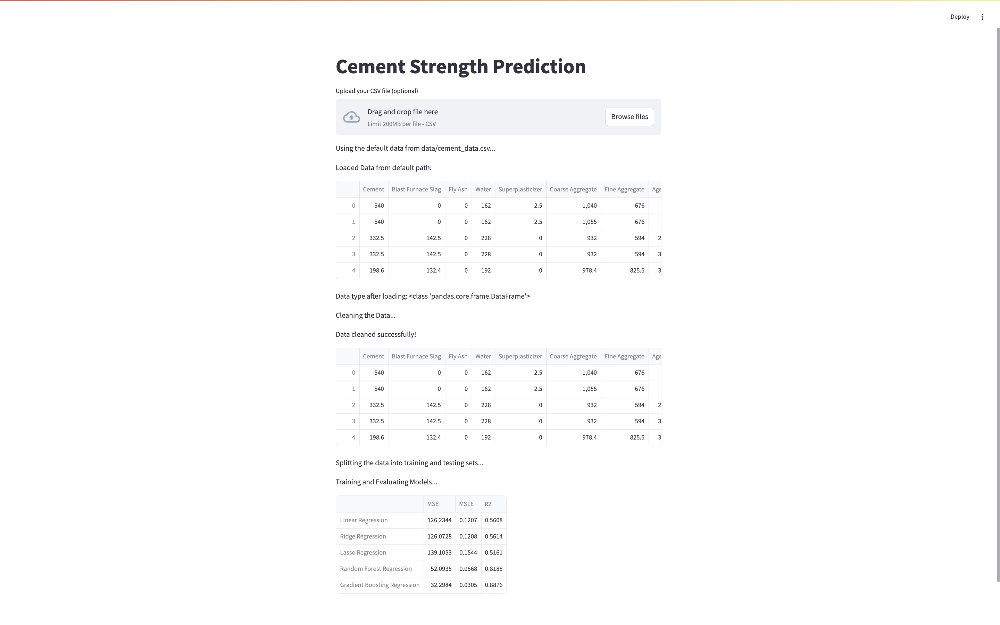

# cement-strength-prediction
## Overview
This project predicts the compressive strength of cement based on various features such as cement composition, water content, and age. The goal is to build a regression model that accurately predicts the cement's strength.

- cement-strength-prediction/
- │
- ├── README.md
- ├── poetry.lock
- ├── pyproject.toml
- ├── config.py
- ├── app.py
- ├── data/
- │   └── cement_data.csv
- ├── notebook/
- │   └── cement_strength_eda.ipynb
- └── src/
    - ├── __init__.py
    - ├── eda.py
    - ├── data_preprocessing.py
    - ├── model_training.py
    - ├── model_prediction.py

## Structure
- `src/` contains all the modules for EDA, data preprocessing, model training, and predictions.
- `notebook/` contains the original Jupyter notebook.
- `data/` contains the dataset.
- `config.py` includes configuration settings for the project.
- `app.py` is the Streamlit app for user interaction.


## Prerequisites

Make sure you have **Poetry** installed. If not, you can install it by running the following command:

```bash
- curl -sSL https://install.python-poetry.org | python3 -
After installation, you can verify it by running:

- poetry --version
Setup
1. Clone the Repository
- Clone the repository to your local machine: git clone git@github.com:SaritaPhD/cement-strength-prediction.git

2. Install Dependencies
- Once the repository is cloned, run the following command to install all required dependencies:
- poetry install
3. Activate Poetry Environment
To activate the Poetry environment, run:

- poetry shell
This command will spawn a new shell with the correct virtual environment activated, allowing you to run your Python scripts and manage dependencies.

4. Run the Streamlit App
After activating the Poetry environment, you can start the Streamlit app by running:

- poetry run streamlit run app.py
This will launch the Streamlit app, and you should be able to access it in your browser at http://localhost:8501.

### How to Use the App
- Upload your CSV file with cement strength data.
- The app will clean, preprocess, and split the data, then train and evaluate several machine learning models.
- The model evaluation results (MSE and R2 scores) will be displayed on the app for comparison.
#### Important Notes
- Data Path: Make sure your dataset path is correctly set in the config.py file. The default path is defined as DATA_PATH in config.py.


   